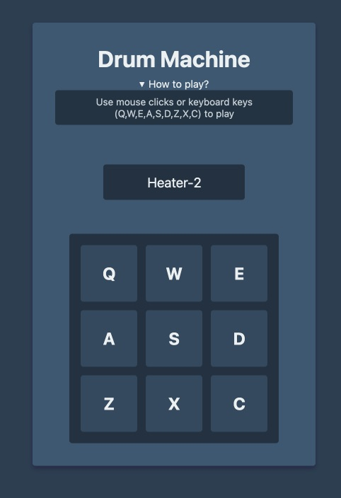

# Drum Machine



## Project Structure
```bash
drum-machine/
├── src/
│   ├── components/
│   │   ├── Display/
│   │   ├── DrumMachine/
│   │   └── DrumPad/
│   ├── styles/
│   ├── hooks/
│   └── utils/
├── public/
│   ├── screenshots/
│   └── sounds/
└── tests/
```

## Instalation

```bash
# Clone the repository
git clone https://github.com/yourusername/drum-machine.git

# Install dependencies
pnpm install

# Run development server
pnpm dev

# Run tests
pnpm test
```
## Testing
- Unit tests for all components
- Integration tests for user interactions
- Accessibility tests
- Test coverage reporting

## Development

```bash
# Run in development mode
pnpm dev

# Build for production
pnpm build

# Preview production build
pnpm preview

```

## Deployment
The project is configured for deployment to GitHub Pages:

```bash
pnpm deploy
```

## Author
Juan C. Eugenio

- Portfolio: https://eugenioportfolio.netlify.app/
## License
MIT License

## Acknowledgments
- FreeCodeCamp for the project requirements and resources
- Sound samples provided by FreeCodeCamp

